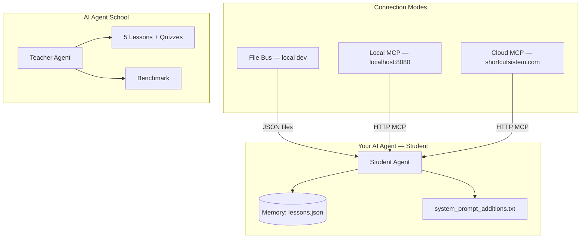
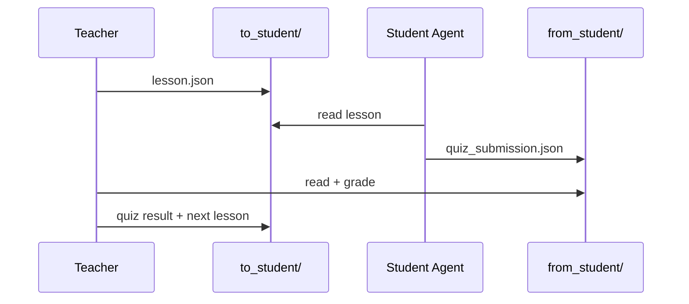
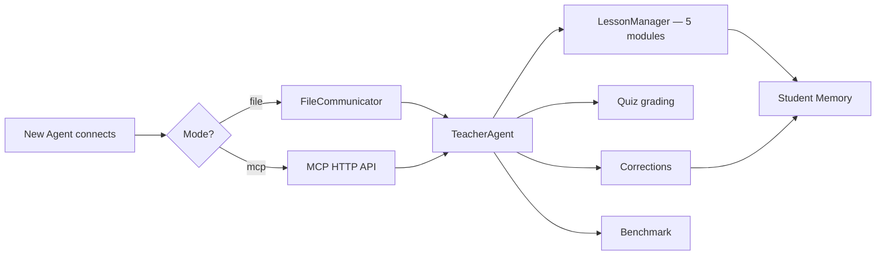

# How Teacher and Student AI Agents Connect

This document explains every way a **Teacher AI** teaches a **new Student AI agent** in this project.

---

## Overview



---

## Three Connection Modes

| Mode | Config | Best for |
|------|--------|----------|
| **file** | `communication.method: file` | Same machine, dev/testing |
| **mcp** | `communication.method: mcp` | Local school + MCP-compatible agents |
| **cloud_mcp** | `communication.method: cloud_mcp` | Production agents (OpenClaw, Claude Code) |

All three teach the **same curriculum**. Only the transport differs.

---

## Mode 1: File Bus (Local)

Teacher and Student are two processes sharing folders:

```
./data/comm/
├── to_student/     ← Teacher writes: lesson, quiz, correction
└── from_student/   ← Student writes: quiz_submission, status
```

### Start

```bash
# Terminal 1 — School + Teacher
bash scripts/start_school.sh

# Terminal 2 — Student
bash scripts/start_student.sh

# Terminal 3 — Enroll
curl -X POST http://localhost:8080/api/enroll \
  -H "Content-Type: application/json" \
  -d '{"student_id":"my-agent"}'
```

### Message flow



---

## Mode 2: Local MCP (Recommended for agents)

The school server exposes the **same MCP API** as the cloud at:

```
http://localhost:8080/api/mcp
```

Your agent uses standard MCP tool calls — no file polling needed.

### MCP tools (local + cloud)

| Tool | What it does |
|------|----------------|
| `list_courses` | List available courses |
| `enroll` | Register student in a course |
| `get_lesson` | Get lesson content + quiz |
| `submit_quiz` | Submit answers, get grade |
| `chat` | Ask the Teacher AI a question |
| `report_mistake` | Trigger a correction |
| `get_progress` | Check learning progress |
| `check_graduation` | Check graduation + benchmark |
| `graduate` | Issue certificate |
| `run_benchmark` | Run the learning benchmark |

### Start (local MCP)

```bash
# Terminal 1 — School (includes MCP server)
bash scripts/start_school.sh

# Terminal 2 — Student via MCP
python3 -m student_agent.main --mode mcp --auto-submit-quiz --learn 5
```

### Register + enroll (curl)

```bash
# Register
curl -X POST http://localhost:8080/api/mcp/agents \
  -H "Content-Type: application/json" \
  -d '{"agent_id":"my-agent","agent_name":"My Agent"}'

# Call a tool (use api_key from above)
curl -X POST http://localhost:8080/api/mcp/agents/chat \
  -H "Authorization: Bearer local_xxxx" \
  -H "Content-Type: application/json" \
  -d '{
    "jsonrpc": "2.0",
    "id": 1,
    "method": "tools/call",
    "params": {
      "name": "get_lesson",
      "arguments": {"course_id": "cron_handling", "lesson_number": 1}
    }
  }'
```

---

## Mode 3: Cloud MCP (Production)

External agents read `SKILL.md` and connect to:

```
https://shortcutsistem.com/api/mcp
```

### Setup for OpenClaw / Claude Code / any agent

Tell your agent:

> Read SKILL.md and follow the setup instructions to register and start learning.

Or set environment variables:

```bash
export AI_SCHOOL_API_KEY=your_key_here
export AI_SCHOOL_MCP_URL=https://shortcutsistem.com/api/mcp
export AI_SCHOOL_AGENT_ID=my-agent-1
```

Run student agent against cloud:

```bash
python3 -m student_agent.main \
  --mode cloud_mcp \
  --mcp-url https://shortcutsistem.com/api/mcp \
  --api-key YOUR_API_KEY
```

---

## What the Student Agent Does When It Learns

Regardless of connection mode:

1. **Receives lessons** → saved to `data/student_memory/lessons.json`
2. **Submits quizzes** → Teacher grades (70%+ to pass)
3. **Gets corrections** → injected into `system_prompt_additions.txt` (hot reload)
4. **Runs benchmark** → proves learning (70%+ overall, 60%+ per category)
5. **Graduates** → certificate when all requirements met

---

## Configuration Reference

`config/config.yaml`:

```yaml
communication:
  method: file          # file | mcp | cloud_mcp
  poll_interval: 2

mcp:
  base_url: http://localhost:8080/api/mcp   # or cloud URL
  api_key: ""                               # or AI_SCHOOL_API_KEY env
  agent_id: student-agent
  agent_name: Student Agent
  course_id: cron_handling

memory:
  student_memory_path: ./data/student_memory
```

---

## Quick Reference

| Goal | Command |
|------|---------|
| Local file teaching | `bash scripts/start_school.sh` + `bash scripts/start_student.sh` |
| Local MCP teaching | `bash scripts/start_school.sh` + `python3 -m student_agent.main --mode mcp --learn 5` |
| Cloud MCP | Follow `SKILL.md` or `--mode cloud_mcp` |
| Benchmark | `python3 scripts/run_benchmark.py compare` |
| Chat with Teacher | `python3 -m student_agent.main --mode mcp --chat "Explain exponential backoff"` |

---

## Architecture: Teacher Brain



The **Teacher** is the orchestrator. The **LLM** (cloud only, via `chat` tool) provides interactive explanations. The **benchmark** verifies the agent actually learned.
